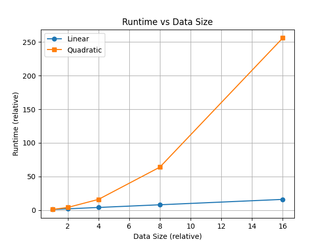
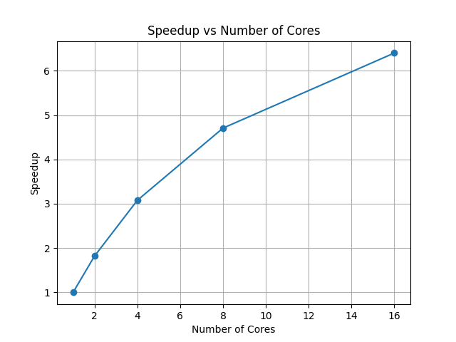
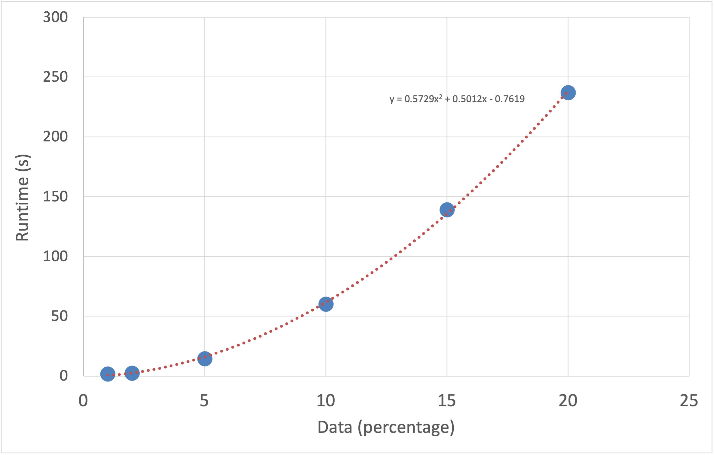
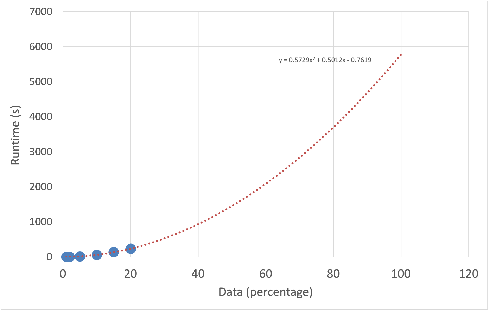

## Learning Outcomes

- Understand key HPC resource concepts
- Know how to run representative benchmarks of your code
- Be able to use simple command-line profiling tools
- Convert benchmark timings into realistic resource requests


## Prerequisites

- Basic familiarity with the command line
- A computational task you want to benchmark


# Understanding HPC Resources

## Key Definitions

::: {.formula-box}
**Core-hours ≈ Wall-clock time × Number of CPU cores**
:::

- **Wall-clock time**: Elapsed time (what a stopwatch measures)
- **CPU time**: Active processor time (excludes I/O waits)  
- **Task**: One independent run (one simulation, dataset, etc.)
- **Job**: What you submit to the scheduler (may contain many tasks)

::: {.callout-tip title='Example'}
A program runs 2 hours using 8 cores = 16 core-hours
:::


## CPU Time vs Wall Time

- **Single core:** CPU time ≈ Wall time
- **Multi-core:** CPU time ≈ Wall time × cores  
- **I/O-heavy:** Wall time > CPU time

```bash
# Example output from /usr/bin/time -v
Elapsed (wall clock) time: 0:02:15
User time (seconds): 120.45
System time (seconds): 12.33
Maximum resident set size (kbytes): 2048000
```
<br>
Understanding this relationship helps optimize resource requests


## Why Measure Rather Than Guess?

<br>

::: columns
::: {.column width="50%"}
### ❌ Common Mistakes
- Ignoring HPC systems are (generally) faster. 
<text style="color:grey">"My laptop takes 1 hour, so I need 100 hours for 100 runs"</text>
- Missing parallelization opportunities
- No overhead for scheduling
:::

::: {.column width="50%"}
### ✅ Best Practice
- Benchmark on target system
- Use representative data
- Measure actual resource usage
- Account for variability
:::
:::


# Scaling Laws


## Scaling Patterns

::: columns
::: {.column width="50%"}
### Linear O(n)
- 2 × data → 2 × time
- Safe to extrapolate
:::

::: {.column width="50%"}
### Quadratic O(n²)
- 2 × data → 4 × time
- All-pairs comparisons
:::

:::

{min-height=100%}


## Testing Your Scaling

```bash
# Simple scaling test
./my_program --data 2percent_sample.csv   # Measure time
./my_program --data 4percent_sample.csv   # Should take ~2x if linear
./my_program --data 8percent_sample.csv   # Should take ~4x if linear
```

<br>
If 8% data takes 10× longer than 2% data, you don't have linear scaling!


## Parallel Strong vs Weak Scaling




## Parallel Scaling Test

```bash
#!/bin/bash
dataset="my_data.csv"

for cores in 1 2 4 8 16; do
    echo "Testing with $cores cores..."
    /usr/bin/time -f "cores=$cores wall=%E cpu=%U+%S" \
        my_parallel_program --input $dataset --threads $cores \
        2>> scaling_results.log
done
```

::: {.callout-note title='Example Results'}

- 1 core: 120s
- 2 cores: 65s (92% efficiency)
- 4 cores: 35s (86% efficiency)
- 8 cores: 25s (60% efficiency)  

:::


# Practical Benchmarking

## The Benchmarking Workflow

1. **Create representative test cases**
2. **Test scaling** (e.g. 2%, 4%, 8% data sizes)
4. **Extrapolate carefully** with safety factors

::: {.callout-tip}
- **Document environment** (software versions, modules)

- **Run end-to-end tests** (include all steps)
:::

## Essential Measurement Tools

### GNU time

```bash
# Basic timing with detailed output
/usr/bin/time -v my_program input.dat

# Custom format for logging
/usr/bin/time -f 'wall=%E user=%U sys=%S maxRSS=%M' my_program input.dat
```

<br>

#### Key Outputs
- `Elapsed`: Wall-clock time
- `User/System time`: CPU time breakdown
- `Maximum resident set size`: Peak memory (KB)

## Example: Benchmark Script

Benchmarking my code with different data sizes


```bash
#!/bin/bash

for size in 2 4 8; do
    echo "Testing ${size}% data size..."
    /usr/bin/time -f 'size=${size}% run=$run wall=%E user=%U sys=%S maxRSS=%M' \
        my_simulation --input data_${size}pct.csv \
        --output results_${size}.dat \
        2>> benchmark_results.log
done

```

::: {.callout-tip title="Allowing for sources of variability..."}

Particularly if your datasets are small, you may need to consider running the benchmark multiple times. For example, adding an extra nested loop:

```bash
    for run in {1..3}; do
```
:::

## Example: Image Processing

**Scenario:** Image processing pipeline

1. Load images from disk
3. Run object detection
4. Save results

**Goal:** Process 10,000 images, estimate resources needed

## Step 1: Create Test Datasets

```bash
# Create subsets of your full dataset
mkdir test_data_5pct test_data_10pct test_data_15pct

# Randomly sample (adjust numbers for your case)
shuf -n  500 full_image_list.txt >  test_data_5pct/image_list.txt
shuf -n 1000 full_image_list.txt > test_data_10pct/image_list.txt
shuf -n 1500 full_image_list.txt > test_data_15pct/image_list.txt
```

::: {.callout-tip}
Use random sampling to ensure representative subsets
:::

## Step 2: Run Benchmarks

```bash
#!/bin/bash
module load languages/python/3.7.12 

for size in 5 10 15; do
    echo "=== Testing ${size}% dataset ==="
    for run in {1..3}; do
        echo "Run $run..."
        /usr/bin/time -f "${size}pct run$run: wall=%E user=%U sys=%S maxRSS_MB=%M" \
            python image_pipeline.py \
            --input test_data_${size}pct/ \
            --output results_${size}pct_run${run}/ \
            2>> timing_results.log
    done
done
```

## Step 3: Analyze Results

```bash
# Extract timing data
grep "wall=" timing_results.log

# Results:
# 5pct run1: wall=0:02:15 user=2:01.45 sys=0:12.33 maxRSS_MB=2048
# 5pct run2: wall=0:02:18 user=2:03.12 sys=0:13.01 maxRSS_MB=2051
# ...
# 15pct run1: wall=0:04:45 user=4:15.22 sys=0:28.11 maxRSS_MB=2055
```

::: {.formula-box}
**Analysis:**  
5% data: ~135 seconds  
10% data: ~285 seconds  
15% data: ~580 seconds  

**Linear scaling confirmed!**  
100% estimate: ~2850 seconds = 27.5 minutes
:::


## If it is nor linear...

If the relationship is not linear, you can use Excel to add a trendline to your chart and choose to display the equation.



## If it is nor linear...

A polynomial of order 2 or 3 is generally a good option for capturing non-linear trends.




# Benchmarking on HPC Systems

## Interactive Benchmarking

::: {.callout-important}
Always benchmark on compute nodes, not login nodes!
:::

```bash
# Request an interactive session
salloc -p short -N 1 -c 4 --mem=8G --time=00:30:00

# Once allocated, run your benchmark
srun --cpu-bind=cores /usr/bin/time -v my_program test_data.csv
```


## Batch Job Benchmarking

```bash
#!/bin/bash
#SBATCH --account=ABC012345
#SBATCH --partition=test
#SBATCH --job-name=benchmark
#SBATCH --output=benchmark_out_%j.txt
#SBATCH --error=benchmark_err_%j.txt
#SBATCH --nodes=1
#SBATCH --cpus-per-task=8
#SBATCH --mem=16G
#SBATCH --time=00:30:00

module load languages/python/3.7.12

export OMP_NUM_THREADS=8  # Match requested CPUs

echo "Starting benchmark at $(date)"
echo "Running on node: $(hostname)"

/usr/bin/time -v srun --cpu-bind=cores \
    python my_program.py --input test_10pct.csv --threads 8
```

## Analyzing Completed Jobs

```bash
# Get job statistics
sacct -j JOBID --format=JobID,Elapsed,TotalCPU,MaxRSS,ReqCPUS,State -P

# Example output:
# JobID|Elapsed|TotalCPU|MaxRSS|ReqCPUS|State
# 12345|00:15:30|01:58:45|2048000K|8|COMPLETED
```

::: {.formula-box}
**Resource Analysis:**  
Wall time: 15.5 minutes  
CPU time: 118.75 minutes  
Peak memory: ~2GB  
**Core-hours: 15.5 min × 8 cores = 2.07 core-hours**
:::


## Estimating GPU Time Requirements

The same benchmarking principles used for CPU-based tasks apply generally to GPU workloads.

However, GPUs often have longer warm-up times. Consider factors like batch size, data transfer overhead, and GPU memory usage, which can significantly affect runtime.

To get accurate estimates, benchmarks should be run with sufficiently large datasets to reflect realistic performance.


# Converting to Resource Requests

## From Benchmarks to Core-Hours

1. **Pick scaling model** from test results
2. **Extrapolate** to full problem size
3. **Choose optimal** parallel configuration
4. **Calculate** core-hours per run
5. **Multiply** by number of runs
6. **Add safety factors**

## Worked Example: Climate Study

::: {.callout-note}
### Scenario
- **Program:** climate_sim
- **Test data:** 20% of full grid (1 year sim)
- **Hardware:** 8 cores, 75% parallel efficiency
- **Measured time:** 45 minutes wall time
- **Scaling:** Linear with grid size
- **Parameter sets:** 50 different configurations
:::

## Resource Calculation

::: {.callout-note}
**Step-by-step calculation:**

Full problem: 5× larger (20% → 100%)  
Time per run: 45 min × 5 = 225 min = 3.75 hours  
Core-hours per run: 3.75 × 8 = 30 core-hours  

Base cost: 30 × 50 runs = 1,500 core-hours  

Safety factors:

- 1.4× (failures)
- 2.0× (development)
- 1.2× (scaling error)  

**Total request: 1,500 × 3.6 = 5,400 core-hours**
:::


# Questions?

<br>
For queries related to these training materials <jgi-training@bristol.ac.uk>

<br>
For other HPC queries <hpc-help@bristol.ac.uk>

<br>
**Happy computing!** 🚀